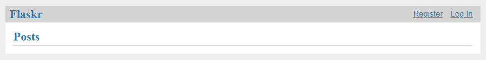
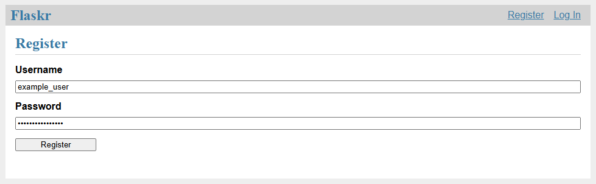
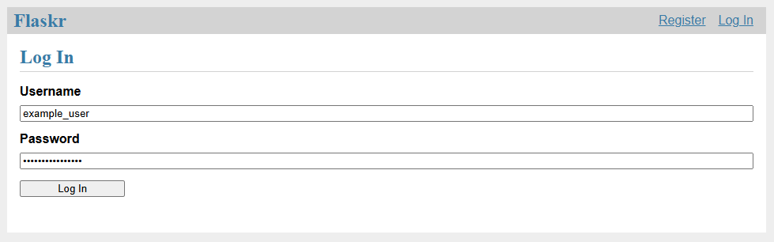
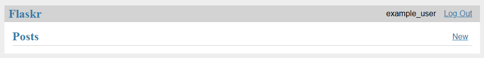
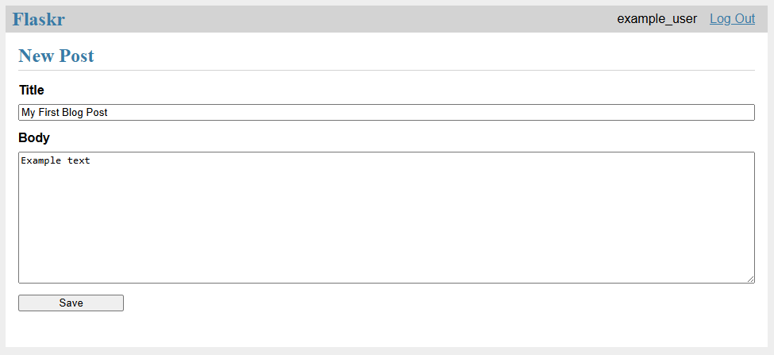
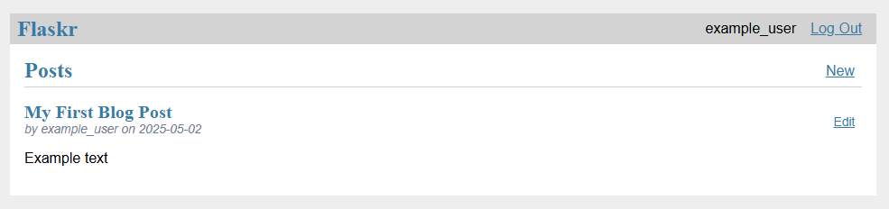
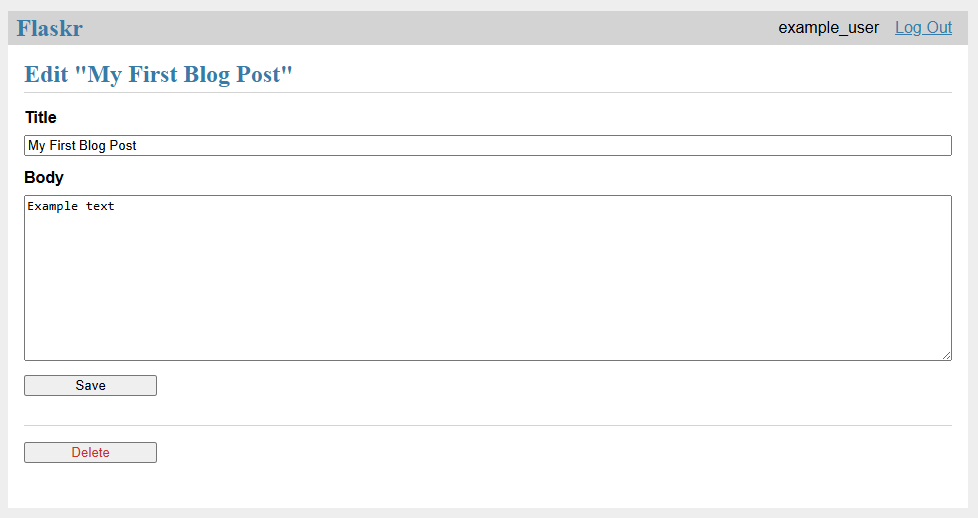
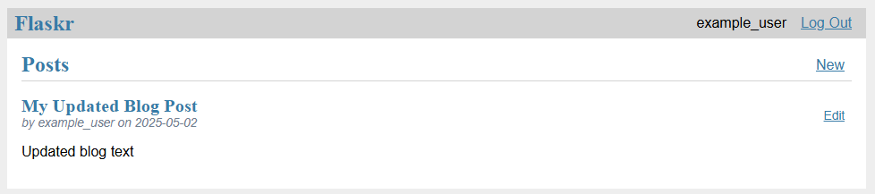
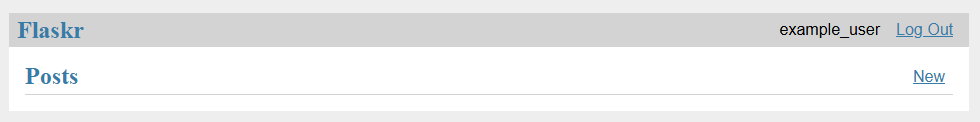

# Flask Blog Tutorial

## Description

This is an app that I created by following the tutorial at https://flask.palletsprojects.com/en/stable/tutorial/.

## Prerequisites

First, fork and clone this project and `cd` into it.

This project uses Python 3.13.2. You can [install it here](https://www.python.org/downloads/release/python-3132/).

Next, set up and activate a virtual environment (such as venv or anaconda). Then, install `Flask`, `pytest`, and `coverage` with this command: `pip install Flask pytest coverage`. Make sure the dependency versions match the [requirements.txt file](requirements.txt).

Next, install this project in your virtual environment with the following command: `pip install -e .` This will install the project in "editable" (or "development") mode. [As described here](https://flask.palletsprojects.com/en/stable/tutorial/install/#install-the-project), this will also allow you to run the app from anywhere, not just the `flask-blog-tutorial` directory.

Finally, create the database with the following command: `flask --app flaskr init-db`.

## Usage

Start the app by running the following command (you can optionally run it in debug mode by adding the `--debug` flag at the end): `flask --app flaskr run`. Navigate to http://127.0.0.1:5000

### Home page

When you first start the app, you will see the following home page:

### Registration

Click the "Register" link to go to the registration page:

**Note:** The "Username" and "Password" fields are required.

### Login

After you register a new user (and whenever you click the "Log In" link), you will be redirected to the following login page:

As with the registration page, the "Username" and "Password" fields are required.

### Blog index page (initially)

When you first login, you will again be redirected to the home page:

This page will list everyone's blog posts, even if you are logged out. When you're logged in, you will see your username in the top-right corner, and you will be able to create blog posts with the "New" button.

### Creating a new blog post

Click the "New" button to go to the "New Post" page:

**Note:** The title is required, but you can leave the body of the blog post blank if you wish.

### Blog index page after creating a new blog post

When you create a new blog post, you will be redirected to the home page. This time, you will see your first blog post and any others that you choose to create!

### Editing or deleting a blog post

To edit or delete a blog post, click the "Edit" button next to the post. You will be redirected here:

To update your blog post, make your changes to the title and/or body and click the "Save" button. You will be redirected to the home page, where you can see your changes:

To delete a blog post, click the "Delete" button. You will receive a confirmation prompt in your browser; click "OK" to confirm.

You will then be redirected to the home page, and you will see that your post has been deleted.

### Logging out

Click the "Log Out" button to log out. You will be redirected to the home page. If you created any blog posts, you can see them here, along with other users' blog posts.

## Running the tests

The tests were created with the Pytest library. Use the `pytest` command to run them.

You can also run the following code coverage commands:
- Measure the code coverage of my tests: `coverage run -m pytest`
- View a simple coverage report in the terminal: `coverage report`
- View an HTML coverage report: `coverage html` (then open htmlcov/index.html in your browser)

## License

This project is licensed under the [MIT License](LICENSE).